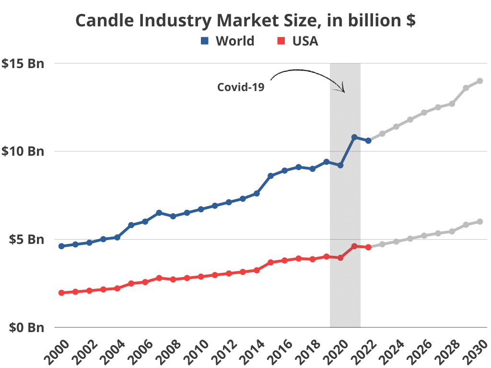
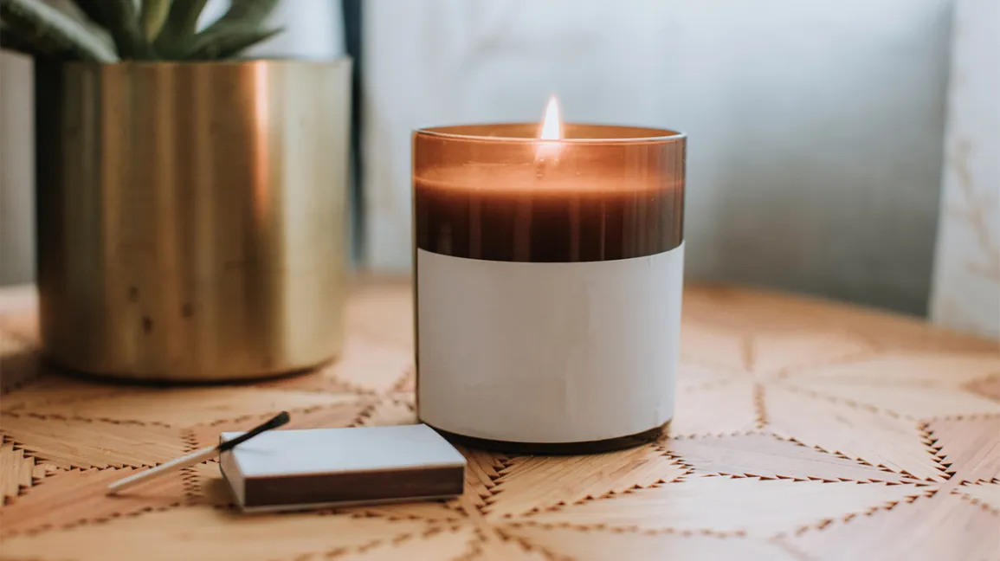
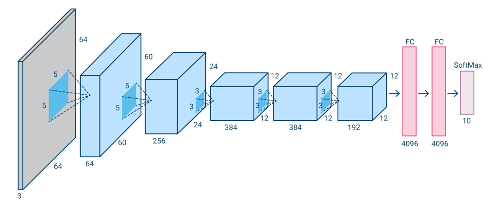

# SafeGlow Solutions

## About us

SafeGlow Solutions is a tech-forward company dedicated to enhancing home safety and energy efficiency. Leveraging advanced sensor technology and innovative software, SafeGlow Solutions specializes in the development of smart environmental monitoring systems that are capable of detecting the presence of a lit candle within a space. Our flagship product, the "CandleSense Monitor," utilizes artificial intelligence to accurately determine whether a candle is burning.

This product is designed to serve households, restaurants, spas, and any other settings where candles are frequently used, providing peace of mind through real-time alerts and automatic safety responses. SafeGlow’s proprietary system can be linked to smartphones and smart home systems, allowing users to receive instant notifications if a candle is left unattended or if it detects anomalies indicating a potential fire hazard. In the event of such detections, CandleSense Monitor can trigger predefined safety protocols, such as alerting the local fire department or activating a home's fire suppression systems.

With a commitment to innovation and customer safety, SafeGlow Solutions aims to reduce fire-related incidents and provide a smarter, safer way to enjoy the ambiance of candlelight. Our blend of sophisticated technology with user-friendly interfaces positions us at the forefront of preventive fire safety in residential and commercial environments.

## How we got started

## Candle Market

The global candle market has been experiencing robust growth and is poised to continue on this trajectory. In 2022, the market size was valued at USD 12.88 billion and is projected to grow at a compound annual growth rate (CAGR) of 5.7% from 2023 to 2030【5†source】. This expansion is being fueled by several factors, including the increasing use of candles for aesthetic purposes, particularly among female millennials, and the rising popularity of scented candles as a component of home decor to enhance the overall ambiance【9†source】.

Diverse estimates suggest that by the end of 2031, the market could surpass USD 16.9 billion, growing at a CAGR of 6.5%【8†source】, or reach USD 14.52 billion by 2029, with an even higher CAGR of 8.2%【13†source】. Furthermore, the market is expected to benefit from an increase in disposable income, which contributes to higher spending on home decoration and festivities, thus propelling the demand for candles used in house and office decoration and during celebrations like Diwali and Christmas【12†source】.

These projections also align with broader trends such as the increase in internet access and mobile use in regions like India, which have influenced market growth as part of the country's digital transformation efforts【14†source】. The market dynamics are indicative of a solid demand base that could continue to support the growth of the candle industry in the coming years, reflecting its integration into various aspects of lifestyle and cultural practices.

## The Problem

- "Annually, an estimated 23,600 fires in residences are caused by candles and result in 1,525 civilian injuries, 165 fatalities, and $390 million in direct property loss." (Topical Fire Research Series Vol. 6, No. 1: Candle Fires in Residential Structures)

- Though candles cause only 3% of all house fires, that number should be down to zero.

- Can be dangerous when left unattended with animals or small children near or around a burning candle. Risk of being knocked over and causing harm and or damage.

- Candles are a notable cause of house fires, although they account for a relatively small percentage of the total number of fires. During the period from 2015 to 2019, candles were responsible for 2% of reported home fires, 3% of home fire deaths, 6% of home fire injuries, and 4% of the direct property damage from home fires​1​. Each year, an estimated 8,200 home fires are started by candles, which also lead to an annual average of 770 injuries and 80 deaths​2​​3​. From 2011 to 2015, U.S. fire departments responded to an average of 8,690 home structure fires caused by candles per year, causing an average of 82 civilian fire deaths, 800 civilian fire injuries, and $295 million in direct property damage annually​4​. Furthermore, candles caused 3% of reported home fires, 3% of home fire deaths, 6% of home fire injuries, and 5% of the direct property damage in home fires according to another source, which also highlighted that about one-third of home candle fires started in bedrooms​5​. These statistics underscore the importance of using candles responsibly and being aware of the potential risks they pose when left unattended or placed near flammable materials.

## Example of images our system is trained with

##### Burning Candle

##### Non Burning Candle

### Data Deck Slides

[Slides](https://docs.google.com/presentation/d/1CZP8NtDrugxVmTx-0QAKVzlozOlF40R57d0yPbNvsCk/edit?usp=sharing)

### Weights and Biases

#### Accuracy 

#### Loss

### AlexNet

AlexNet is a type of artificial intelligence program designed to recognize and classify images. Imagine it like a smart robot that can look at a photo and tell you what's in it—like pointing out a cat, a dog, or a car. It's made up of layers that act like filters, each one learning to recognize different parts of the picture, from simple edges and colors to complex objects. It was a big deal because it worked much better and faster than previous image-recognizing programs, especially because it used special computer graphics cards to speed up the process. 

[Alexnet](https://colab.research.google.com/drive/1k2DbZNns2Mcn0VL2yIxZh8zxRvDX_w6M?usp=sharing)

## Contact Information

If you have any questions please contact us at _____

