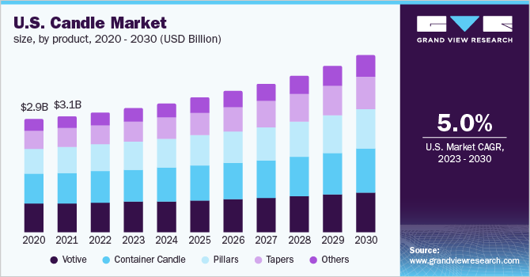
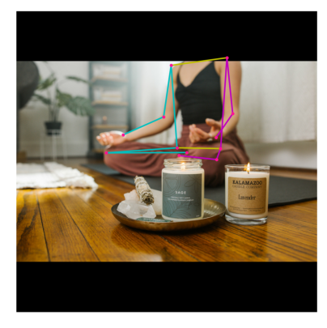

# SafeGlow Solutions

## About us

SafeGlow Solutions is a tech-forward company dedicated to enhancing home safety and energy efficiency. Leveraging advanced sensor technology and innovative software, SafeGlow Solutions specializes in the development of smart environmental monitoring systems that are capable of detecting the presence of a lit candle within a space. Our flagship product, the "CandleSense Monitor," utilizes artificial intelligence to accurately determine whether a candle is burning.

This product is designed to serve households, restaurants, spas, and any other settings where candles are frequently used, providing peace of mind through real-time alerts and automatic safety responses. SafeGlow’s proprietary system can be linked to smartphones and smart home systems, allowing users to receive instant notifications if a candle is left unattended or if it detects anomalies indicating a potential fire hazard. In the event of such detections, CandleSense Monitor can trigger predefined safety protocols, such as alerting the local fire department or activating a home's fire suppression systems.

With a commitment to innovation and customer safety, SafeGlow Solutions aims to reduce fire-related incidents and provide a smarter, safer way to enjoy the ambiance of candlelight. Our blend of sophisticated technology with user-friendly interfaces positions us at the forefront of preventive fire safety in residential and commercial environments.

## How we got started

## Candle Market

             

The global candle market has been experiencing robust growth and is poised to continue on this trajectory. In 2022, the market size was valued at USD 12.88 billion and is projected to grow at a compound annual growth rate (CAGR) of 5.7% from 2023 to 2030 [1](https://www.grandviewresearch.com/industry-analysis/candles-market#:~:text=The%20global%20candle%20market%20size,household%20application%2C%20demand%20form). This expansion is being fueled by several factors, including the increasing use of candles for aesthetic purposes, particularly among female millennials, and the rising popularity of scented candles as a component of home decor to enhance the overall ambiance [2](https://growthmarketreports.com/report/candlemarketglobalindustryanalysis#:~:text=Candle%20Market%20Outlook%202031,rising%20popularity%20of%20scented%20candles).

Diverse estimates suggest that by the end of 2031, the market could surpass USD 16.9 billion, growing at a CAGR of 6.5% [3](https://www.transparencymarketresearch.com/candle-market.html), or reach USD 14.52 billion by 2029, with an even higher CAGR of 8.2% [4](https://www.maximizemarketresearch.com/market-report/candle-market/42231/). Furthermore, the market is expected to benefit from an increase in disposable income, which contributes to higher spending on home decoration and festivities, thus propelling the demand for candles used in house and office decoration and during celebrations like Diwali and Christmas [5](https://www.verifiedmarketresearch.com/product/candle-market/).

These projections also align with broader trends such as the increase in internet access and mobile use in regions like India, which have influenced market growth as part of the country's digital transformation efforts [6](https://www.polarismarketresearch.com/industry-analysis/candle-market). The market dynamics are indicative of a solid demand base that could continue to support the growth of the candle industry in the coming years, reflecting its integration into various aspects of lifestyle and cultural practices.

## The Problem

- Candles are a notable cause of house fires, although they account for a relatively small percentage of the total number of fires. During the period from 2015 to 2019, candles were responsible for 2% of reported home fires, 3% of home fire deaths, 6% of home fire injuries, and 4% of the direct property damage from home fires​ [7](https://www.nfpa.org/education-and-research/home-fire-safety/candles?l=49)​. Each year, an estimated 8,200 home fires are started by candles, which also lead to an annual average of 770 injuries and 80 deaths​ [8](https://candles.org/firesafetycandles/#:~:text=There%E2%80%99s%20a%20special%20beauty%20and,Consumer%20Product%20Safety%20Commission%E2%80%A6),[9](https://blaizencandles.com/candles-and-house-fires/). From 2011 to 2015, U.S. fire departments responded to an average of 8,690 home structure fires caused by candles per year, causing an average of 82 civilian fire deaths, 800 civilian fire injuries, and $295 million in direct property damage annually​ [10](https://www.nfpa.org/-/media/Files/News-and-Research/Fire-statistics-and-reports/Fact-sheets/CandleFactSheet.ashx#:~:text=In%202011%E2%80%932015%2C%20U,of%20the)​. Furthermore, candles caused 3% of reported home fires, 3% of home fire deaths, 6% of home fire injuries, and 5% of the direct property damage in home fires according to another source, which also highlighted that about one-third of home candle fires started in bedrooms​ [11](https://tabernaclerescue.com/safety/candle-fire-safety/#:~:text=Candles%20caused%203,of%20the%20associated%20injuries)​. These statistics underscore the importance of using candles responsibly and being aware of the potential risks they pose when left unattended or placed near flammable materials.

- Can be dangerous when left unattended with animals or small children near or around a burning candle. Risk of being knocked over and causing harm and or damage.

## Example of images our system is trained with

##### Burning Candle

##### Non Burning Candle

## Data Deck Slides

[Slides](https://docs.google.com/presentation/d/1CZP8NtDrugxVmTx-0QAKVzlozOlF40R57d0yPbNvsCk/edit?usp=sharing)

## Weights and Biases
- 90% accuracy
- 42% loss

     

## AlexNet

AlexNet is a type of artificial intelligence program designed to recognize and classify images. Imagine it like a smart robot that can look at a photo and tell you what's in it—like pointing out a cat, a dog, or a car. It's made up of layers that act like filters, each one learning to recognize different parts of the picture, from simple edges and colors to complex objects. It was a big deal because it worked much better and faster than previous image-recognizing programs, especially because it used special computer graphics cards to speed up the process. 

[Alexnet](https://colab.research.google.com/drive/1k2DbZNns2Mcn0VL2yIxZh8zxRvDX_w6M?usp=sharing)

**Python and Colab in AlexNet:**
AlexNet, like many neural networks, is often implemented using Python due to its straightforward syntax and powerful machine learning libraries. Tools like Google Colab provide an accessible platform for running Python code. Colab is particularly useful for AlexNet as it offers an easy interface and access to high-performance hardware such as GPUs, which are crucial for processing the large amounts of data involved in neural network training.

**GPU, Filters, Feature Map, and Pooling:**
The use of GPUs is integral to AlexNet's design. GPUs accelerate the processing of complex calculations required for training and running neural networks, making them much faster compared to using standard CPUs. In AlexNet, filters are used within its convolutional layers to detect various features in images, like edges or textures. These filters create 'feature maps,' which are transformed versions of the input images highlighting specific features. Following this, AlexNet applies pooling to these feature maps. Pooling reduces the size and complexity of the data, which helps in reducing computational load and in focusing on the most significant features of the images.

**ReLU, Tensor, Matrix:**
AlexNet employs the ReLU (Rectified Linear Unit) function to introduce non-linearity, which is crucial for learning complex patterns. ReLU works by keeping positive values unchanged while turning negative values to zero, thus deciding which features are important for the network's learning process. The network handles data, including images and feature maps, as tensors. Tensors are multi-dimensional arrays suited for efficiently managing the extensive calculations in neural networks. Additionally, matrix operations are fundamental in AlexNet, particularly in convolutional layers where the processing of images involves numerous matrix calculations.

**RGB and Pixel:**
When processing color images, AlexNet uses the RGB color model. In this model, each image is represented as three matrices corresponding to the red, green, and blue components. This allows the network to process and analyze the color information within images. At the most basic level, each image AlexNet processes is composed of pixels, the smallest unit of a digital image. The network examines these pixels in relation to their neighbors to identify and learn from patterns in the images.

In summary, AlexNet is a sophisticated system that leverages a combination of advanced computing techniques and mathematical concepts to efficiently process and learn from visual data. Its architecture is designed to dissect, analyze, and interpret images, enabling it to recognize and classify various elements within these images. The use of GPUs, coupled with the efficient handling of data through tensors and matrices, allows AlexNet to perform complex image recognition tasks effectively.

### Explanation of Terms

1. **Python**: This is a type of computer language. Think of it like English or Spanish, but instead of people, it's used to communicate instructions to computers. It's popular because it's easy to learn and can be used for many different things.

2. **Colab**: Short for "Colaboratory", this is a free online platform provided by Google. It's like a digital notebook that lets you write Python code, run it, and share it with others. It's especially useful for data science and machine learning projects.

3. **GPU (Graphics Processing Unit)**: This is a part of the computer that's really good at handling visuals, like video games or 3D graphics. But it's also great for AI tasks because it can do a lot of calculations at the same time, making everything much faster.

4. **Filters**: In image processing, filters are like special glasses that a computer uses to see images in different ways. For example, one filter might help the computer focus on the edges in a picture, while another might highlight the colors.

5. **Feature Map**: This is the result you get after applying filters to an image. It's a new version of the image that shows specific features more clearly, like edges, textures, or certain shapes.

6. **Pooling**: In image processing, pooling is a way to simplify the image. Imagine you have a big picture; pooling helps to shrink it down by keeping only the most important parts, so the computer doesn't have to work as hard to understand it.

7. **ReLU (Rectified Linear Unit)**: This is a simple rule that an AI uses to decide whether to pay attention to something. It looks at the information it gets, and if that information is useful, it keeps it; if not, it ignores it.

8. **Tensor**: Think of a tensor like a magic box that can hold numbers in many different layers and dimensions. It's a fancy term used in mathematics and physics, but in AI, it's just a way to organize and process a lot of data at once.

9. **Matrix**: This is like a grid or a table filled with numbers. It's a simple way to organize data so that computers can work with it more easily, especially in calculations involving images or complex equations.

10. **RGB (Red, Green, Blue)**: This is a color model used to create colors on screens like your computer or phone. By mixing different amounts of red, green, and blue light, you can make almost any color.

11. **Pixel**: This is the smallest part of a digital image, like a tiny dot. Each pixel has a color, and when you put lots of pixels together, they make up the picture you see on the screen.

## Feature Map

[Custom data filter](https://colab.research.google.com/drive/1t97HXnuHNHHOeTKADFFIA5ycf-JCHq4Z?usp=sharing)

## Pose

[Simple Pose Machine](https://colab.research.google.com/drive/1BZBGKpceLqz5gi9phE3OnYrBJQWjCTcZ?usp=sharing)

## Automatic Mask Generator

[SAM](https://colab.research.google.com/drive/1Uqh_48-YqvHL_FQPvwSrRHcrT9lIFpD_?usp=sharing)

                     

The "SamAutomaticMaskGenerator" is a tool used in image processing to create masks, which are used to isolate certain areas of an image. It works by scanning an image in a grid pattern and, at each point, generating multiple masks based on input prompts. These masks are then refined by filtering out lower-quality ones and removing duplicates, a process known as non-maximal suppression. Additionally, the tool can improve the masks by analyzing different sections of the image and cleaning up any imperfections, like small disconnected areas. This method is efficient and sophisticated, making it suitable for creating large image datasets, such as SA-1B, by automatically processing a vast number of images and accurately isolating various features within them.

## Contact Information

If you have any questions please contact us at contact@safeglowsolutions.com

